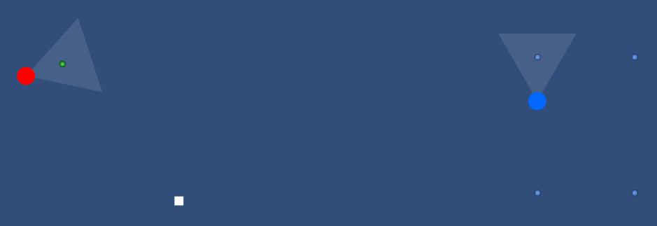
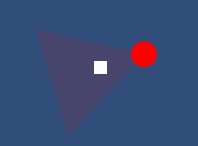
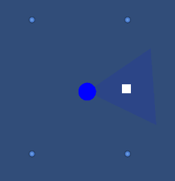

# AI_Chasing
2D enemy patroling/chasing AI

# How it works
* There are two types of enemies in the scene (Red and Blue).
* The main difference between the types is the AI behavior.
* There is also the player character which can be moved.

# Red Enemy - AI_A
1. By default, it remembers the current position and selects random point within radius from current position, then it walks towards it. After reaching the point, it selects another one, etc.
2. If a player character is in the rane of view of the enemy, the enemy begins to chase the player with increased speed.
3. If, during the chase, player escape from the field of view of the enemy, the enemy remembers last seen player position nad starts walking around it (like in point 1)

# Blue Enemy - AI_B
1. By default, it patrols along with selected path (point to point)
2. If a player character is in the rane of view of the enemy, the enemy remembers the position when the patrol was interrupted and starts chasing the player with increased speed.
3. If, during the chase, player escape from the field of view of the enemy, the enemy returns to the remembered position, when patrol wqas interrupted and continues patroling.
4. If, while returning, the player approaches again, the enemy will resume the chase, all the time remembering the old position to which it is to return.

# Screenshots

